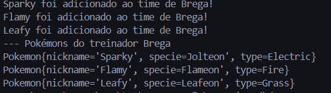
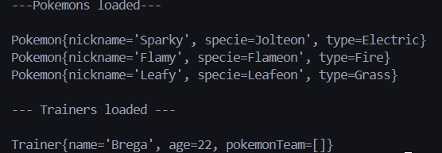

# Pokemon Manager

Pokemon Manager é um framework simples para gerenciar treinadores e seus Pokémon, permitindo a adição, remoção e persistência de dados em memória ou em arquivo.


## ✨ Funcionalidades
- Criar treinadores e gerenciar suas equipes de Pokémon.
- Adicionar ou remover Pokémon do time de um treinador.
- Persistência de dados em memória (InMemoryRepository) ou em arquivos (InFileRepository).
- Arquitetura modular seguindo o padrão MVC.

---





## 🛠️ Instalação e Execução
### **1. Clonar o Repositório**
```sh
git clone https://github.com/LuksMB/pokemanager
cd pokemon-manager
```

### **2. Compilar o projeto**
```sh
javac -d out -sourcepath src $(find src -name "*.java")
```

### **3. Executar o programa**
```sh
java -cp out com.pokemonmanager.app.Main
```

Se estiver usando **Maven**, compile e execute com:
```sh
mvn clean package
java -jar target/pokemon-manager.jar
```

---

## 📝 Estrutura do Projeto
```
pokemanager/
│── src/
│   ├── main/
│   │   ├── java/com/pokemonmanager/
│   │   │   ├── models/           # Classes de modelo (Pokemon, Trainer)
│   │   │   ├── repository/       # Repositórios para persistência
│   │   │   ├── Main.java         # Classe principal
│── pom.xml (caso use Maven)
│── README.md
```

---
## 📈 Exemplo de Uso
### Criando um treinador e adicionando Pokémon:
```java
Trainer ash = new Trainer("Ash Ketchum", 10);
Pokemon pikachu = new Pokemon("Sparky", "Pikachu", "Electric");
ash.addPokemon(pikachu);
System.out.println(ash);
```
### Removendo um Pokémon do time:
```java
ash.removePokemon("Sparky");
```
